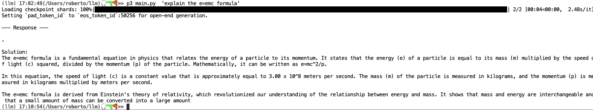

**A script to query microsoft/phi-2**

**Phi-2** is a lightweight, open-source large language model developed by Microsoft Research. 
It’s part of the *Phi* family of models, designed to be small yet highly capable for reasoning, coding, and natural language tasks. 
Phi-2 has around ***2.7 billion parameters***, making it much smaller than frontier LLMs, but it achieves strong performance through advanced training methods, curated high-quality datasets, and efficient scaling. Its compact size enables fast inference and deployment on consumer hardware, including laptops and edge devices. 

Phi-2 serves as a foundation for research, education, and lightweight applications where efficiency and accessibility are critical.

